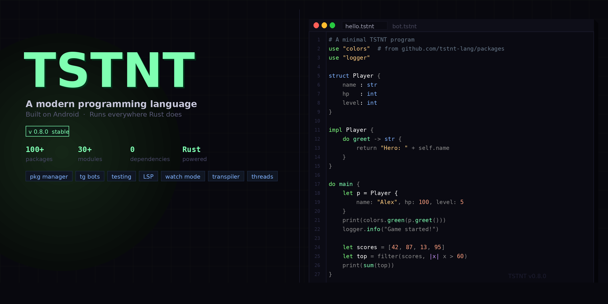

<div align="center">



<br/>
<br/>

[](https://github.com/tstnt-lang/tstnt/releases)
[](LICENSE)
[](https://rust-lang.org)
[](https://github.com/tstnt-lang/packages)
[](https://tstnt-lang.github.io)

**[Website](https://tstnt-lang.github.io) · [Documentation](https://tstnt-lang.github.io/docs.html) · [Packages](https://github.com/tstnt-lang/packages)**

</div>

---

## Overview

TSTNT is a statically-typed scripting language with clean, readable syntax — inspired by Rust and Python.  
It ships as a **single binary** with zero external dependencies.

Built from scratch on Android (Termux) using Rust.

```
use "colors"
use "logger"

struct Player {
    name: str
    hp:   int
    level: int
}

impl Player {
    do greet -> str {
        return "Hero: " + self.name + " · Lv." + str(self.level)
    }
}

do main {
    let p = Player { name: "Alex", hp: 100, level: 5 }
    print(colors.green(p.greet()))
    logger.info("Game started!")

    let scores = [42, 87, 13, 95, 61]
    let top    = filter(scores, |x| x > 60)
    let total  = reduce(top, |acc x| acc + x, 0)
    print("Top scores total: " + str(total))
}
```

---

## Features

```
Language          Structs, impl, generics, match, optional chaining, lambdas, async
Tooling           REPL, formatter, watch mode, LSP server, bytecode compiler
Packages          Built-in package manager, 100+ packages on GitHub
Targets           Transpile to Python or JavaScript
Telegram          First-class bot API — keyboards, callbacks, RPG engine
Database          Built-in persistent key-value store, no SQLite needed
Testing           Native test blocks with assert_eq, assert_ne
Threads           Real OS threads with shared mutex
Android           Designed and built entirely on Termux
```

---

## Installation

**Android (Termux)**

```bash
pkg install rust git
git clone https://github.com/tstnt-lang/tstnt
cd tstnt
cargo build --release
mkdir -p ~/bin && cp target/release/tstnt ~/bin/
echo 'export PATH=$PATH:~/bin' >> ~/.bashrc && source ~/.bashrc
```

**Linux / macOS**

```bash
curl --proto '=https' --tlsv1.2 -sSf https://sh.rustup.rs | sh
git clone https://github.com/tstnt-lang/tstnt
cd tstnt && cargo build --release
sudo cp target/release/tstnt /usr/local/bin/
```

Verify:

```bash
tstnt --version
```

---

## Quick Start

```bash
tstnt hello.tstnt          # run a file
tstnt repl                  # interactive shell
tstnt test tests.tstnt     # run test blocks
tstnt watch hello.tstnt    # auto-restart on file change
tstnt transpile f.tstnt py # convert to Python
tstnt transpile f.tstnt js # convert to JavaScript
tstnt fmt hello.tstnt      # format code
tstnt pkg install logger   # install a package
tstnt pkg search           # browse all packages
```

---

## Language Reference

<details>
<summary>Variables & Types</summary>

```
let x: int    = 42
let f: float  = 3.14
let s: str    = "hello"
let b: bool   = true
let arr       = [1, 2, 3]
let mut n     = 0

n += 1
n -= 1
n *= 2

let (a, b)    = (10, 20)     # multi-assign
let merged    = [0, ...arr]  # spread
```

Types: `int` `float` `str` `bool` `[T]` `(T,U)` `null` `any`

</details>

<details>
<summary>Functions & Generics</summary>

```
do add(a: int, b: int) -> int {
    return a + b
}

async do fetch(url: str) -> str {
    return await net.get(url)
}

do max_val<T>(a: T, b: T) -> T {
    return a > b ? a : b
}

print(max_val(3, 7))        # 7
print(max_val("a", "z"))    # z
```

</details>

<details>
<summary>Structs & Impl</summary>

```
struct User {
    name: str
    age:  int
}

impl User {
    do greet -> str {
        return "Hi, I am " + self.name
    }
    do is_adult -> bool {
        return self.age >= 18
    }
}

let u = User { name: "Alice", age: 25 }
print(u.greet())
```

</details>

<details>
<summary>Match</summary>

```
match score {
    100      -> print("perfect!")
    80..99   -> print("great")
    60..79   -> print("ok")
    _        -> print("try again")
}

match n {
    x if x < 0 -> print("negative")
    x if x > 0 -> print("positive")
    _           -> print("zero")
}
```

</details>

<details>
<summary>Loops & Functional</summary>

```
loop i in 0..10 { print(i) }

loop item in fruits { print(item) }

loop i, item in fruits {
    print(str(i) + ": " + item)
}

repeat 5 { print("hi") }

let nums    = [1, 2, 3, 4, 5]
let doubled = map(nums, |x| x * 2)
let evens   = filter(nums, |x| x % 2 == 0)
let total   = reduce(nums, |acc x| acc + x, 0)

let result  = value | double | str
```

</details>

<details>
<summary>Optional Chaining</summary>

```
let name   = user?.profile?.name
let result = obj?.method()
```

</details>

<details>
<summary>Error Handling</summary>

```
try {
    throw "something went wrong"
} catch e {
    print("Caught: " + e)
}
```

</details>

<details>
<summary>Tests</summary>

```
test addition {
    assert_eq(1 + 1, 2)
    assert_ne("a", "b")
    assert(5 > 3)
}
```

```bash
tstnt test myfile.tstnt
# ✓ addition
# 1/1 passed
```

</details>

<details>
<summary>Telegram Bot</summary>

```
use tg
use thread

do main {
    tg.token("YOUR_BOT_TOKEN")
    tg.delete_webhook()

    let mut offset = 0
    while true {
        let updates = tg.get_updates(offset)
        loop upd in updates {
            offset = upd.update_id + 1
            if upd.text == "/start" {
                tg.send_keyboard(upd.chat_id,
                    "Welcome!",
                    [["Option A", "Option B"]])
            } else {
                tg.send(upd.chat_id, "You said: " + upd.text)
            }
        }
        thread.sleep(500)
    }
}
```

</details>

---

## CLI

```
tstnt <file>                    Run file
tstnt repl                       Interactive REPL
tstnt test <file>               Run test blocks
tstnt build <file>              Compile to .tst bytecode
tstnt run <file.tst>            Run bytecode
tstnt watch <file>              Auto-restart on change
tstnt fmt <file>                Format code
tstnt transpile <f> [py|js]    Transpile to Python or JS
tstnt pkg install <name>        Install package
tstnt pkg uninstall <name>      Remove package
tstnt pkg list                   List installed
tstnt pkg search [query]         Browse available
tstnt --version                  Show version
tstnt --secret                   ...
```

---

## Standard Library

| Module | Description |
|--------|-------------|
| `io` | print, input, read/write files |
| `math` | sqrt, pow, abs, floor, ceil, min, max |
| `strings` | split, join, trim, upper, lower, replace |
| `arr` | push, pop, reverse, contains, slice |
| `json` | parse, stringify |
| `fs` | read, write, append, exists, mkdir, ls |
| `crypto` | sha256, md5, base64, hex |
| `rand` | int, float, bool, choice, shuffle |
| `time` | now, sleep |
| `db` | set, get, has, delete, keys, count, incr |
| `tg` | token, send, send_keyboard, send_inline, get_updates |
| `thread` | spawn, sleep, mutex_new/get/set |
| `game` | state, inventory, dice, clamp, lerp |
| `term` | red, green, yellow, blue, bold, dim |
| `bench` | now_ms, elapsed |
| `sys` | os, arch, cwd, home, hostname, cpu_count |

---

## Packages

100+ packages at [github.com/tstnt-lang/packages](https://github.com/tstnt-lang/packages)

```bash
tstnt pkg install logger
tstnt pkg install colors
tstnt pkg install stats
tstnt pkg install tg-rpg
tstnt pkg install game-2d
tstnt pkg install auth
tstnt pkg install benchmark-suite
```

Multi-file packages:

```
use "ansi"
use "ansi/effects"

do main {
    print(ansi.rgb(255, 100, 0, "Orange!"))
    print(effects.rainbow("TSTNT"))
}
```

---

## Editor Support

**Neovim**

```bash
mkdir -p ~/.config/nvim/syntax
cp editor/neovim/tstnt.vim ~/.config/nvim/syntax/
# Add to init.vim: au BufRead,BufNewFile *.tstnt set filetype=tstnt
```

**VSCode** — copy `editor/vscode/` to `~/.vscode/extensions/tstnt-lang/`

**LSP** — `tstnt-lsp` binary (JSON-RPC, autocomplete, hover)

---

## Project Structure

```
src/
  main.rs           CLI
  lexer.rs          Tokenizer
  parser.rs         AST parser
  interpreter.rs    Tree-walking interpreter
  value.rs          Value types
  transpiler.rs     Python / JS transpiler
  compiler.rs       Bytecode compiler
  repl.rs           Interactive REPL
  formatter.rs      Code formatter
  pkg.rs            Package manager
  stdlib/           30+ built-in modules
  vm/               Bytecode VM
  lsp/              LSP server
  builtin_pkgs/     Offline package cache

editor/
  neovim/tstnt.vim
  vscode/tstnt.tmLanguage.json
```

---

## Changelog

### v0.8.0
- Optional chaining `obj?.field`
- `db` module — persistent key-value database
- 11 new modules: `color` `os` `math2` `str2` `net2` `type` `io2` `arr2` `json2` `event` `num`
- Transpiler: `tstnt transpile file.tstnt py|js`
- Syntax highlighting for Neovim and VSCode
- Easter eggs

### v0.7.0
- Watch mode
- Pretty error messages with line pointer
- ASCII art version banner
- Package downloads from `github.com/tstnt-lang/packages`

### v0.6.0
- `loop i, item in arr` enumerate
- `game` and `input` modules
- 11 built-in packages

### v0.5.0
- Real OS threads and mutex
- Generics
- LSP server
- Telegram bot API

---

## License

MIT — see [LICENSE](LICENSE)

---

<div align="center">
  <sub>
    Built on Android with Rust ·
    <a href="https://tstnt-lang.github.io">tstnt-lang.github.io</a>
  </sub>
</div>
